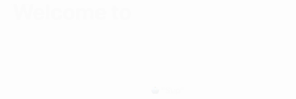

# NextJS + GSAP animation starter
Learn how to add and use GSAP animation with a NextJS app.
*The tutorials are under development and coming this summer.*

### Getting started with the repo
- Clone the repository, the current starter is on the main branch
- `yarn` or `npm install` to download the necessary `node_modules`
- `yarn dev` or `npm run dev` to spin up the development server

### How to reproduce this starter
- `npm init next-app nextjs-blog` to download the necessary NextJS starter blog
- `npm install gsap` to install the gsap library 
- ✨

#### What you will see

### Keep these open is your browser tab
- [GSAP Cheatsheet](https://greensock.com/cheatsheet/)
### References
- [NextJS](https://nextjs.org/)
- [Greensock animation library](https://greensock.com/)
- [Learning NextJS by building a blog](https://nextjs.org/learn/basics/create-nextjs-app)